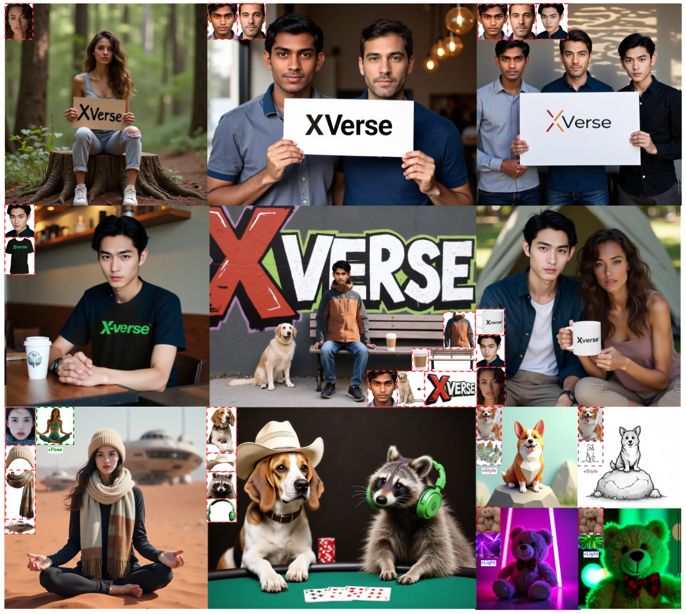
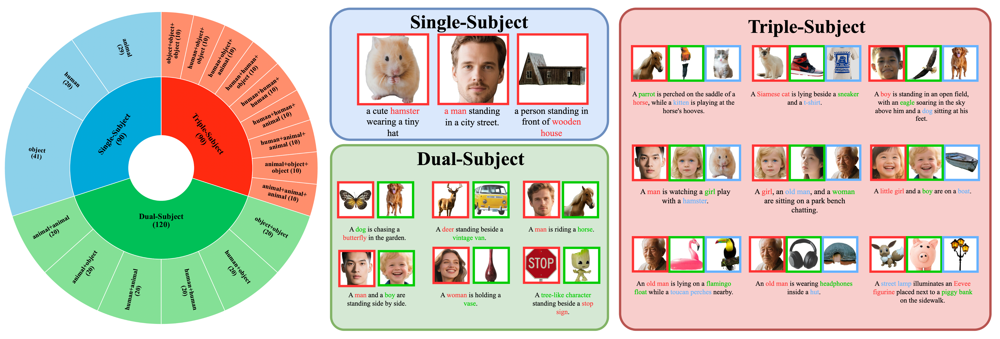

# XVerse: Consistent Multi-Subject Control of Identity and Semantic Attributes via DiT Modulation

<p align="center">
    <a href="https://arxiv.org/abs/2506.21416">
            
    </a>
    <a href="https://bytedance.github.io/XVerse/">
        
    </a>
    <a href="https://github.com/bytedance/XVerse/tree/main/assets">
        
    </a>
    <a href="https://huggingface.co/ByteDance/XVerse">
        
    </a>    
</p>

## 🔥 News
- **2025.7.8**: Supports low VRAM inference, can run the XVerse model in 24GB VRAM.
- **2025.6.26**: The code has been released!



## 📖 Introduction

**XVerse** introduces a novel approach to multi-subject image synthesis, offering **precise and independent control over individual subjects** without disrupting the overall image latents or features. We achieve this by transforming reference images into offsets for token-specific text-stream modulation.

This innovation enables high-fidelity, editable image generation where you can robustly control both **individual subject characteristics** (identity) and their **semantic attributes**. XVerse significantly enhances capabilities for personalized and complex scene generation.

## ⚡️ Quick Start

### Requirements and Installation

First, install the necessary dependencies:

```bash
# Create a conda environment named XVerse with Python version 3.10.16
conda create -n XVerse python=3.10.16 -y
# Activate the XVerse environment
conda activate XVerse
# Install the correct version of pytorch (According to your machine)
pip install torch==2.6.0 torchvision==0.21.0 torchaudio==2.6.0 --index-url https://download.pytorch.org/whl/cu124
# Use pip to install the dependencies specified in requirements.txt
pip install -r requirements.txt
# Install flash-attn
pip install flash-attn==2.7.4.post1 --no-build-isolation
# Update version of httpx
pip install httpx==0.23.3
```

Next, download the required checkpoints:
```bash
cd checkpoints
bash ./download_ckpts.sh
cd ..
```
**Important**: You'll also need to download the face recognition model `model_ir_se50.pth` from [InsightFace_Pytorch](https://github.com/TreB1eN/InsightFace_Pytorch) and place it directly into the `./checkpoints/` folder.

After that, you can export the model paths as environment variables. This step ensures that the subsequent inference scripts can locate the necessary models correctly:
``` bash
export FLORENCE2_MODEL_PATH="./checkpoints/Florence-2-large"
export SAM2_MODEL_PATH="./checkpoints/sam2.1_hiera_large.pt"
export FACE_ID_MODEL_PATH="./checkpoints/model_ir_se50.pth"
export CLIP_MODEL_PATH="./checkpoints/clip-vit-large-patch14"
export FLUX_MODEL_PATH="./checkpoints/FLUX.1-dev"
export DPG_VQA_MODEL_PATH="./checkpoints/mplug_visual-question-answering_coco_large_en"
export DINO_MODEL_PATH="./checkpoints/dino-vits16"
```

### Local Gradio Demo

To run the interactive Gradio demo locally, execute the following command:
```bash
python run_demo.py
```

#### Input Settings Explained
The Gradio demo provides several parameters to control your image generation process:
* **Prompt**: The textual description guiding the image generation.
* **Generated Height/Width**: Use the sliders to set the shape of the output image.
* **Weight_id/ip**: Adjust these weight parameters. Higher values generally lead to better subject consistency but might slightly impact the naturalness of the generated image.
* **latent_lora_scale and vae_lora_scale**: Control the LoRA scale. Similar to Weight_id/ip, larger LoRA values can improve subject consistency but may reduce image naturalness.
* **vae_skip_iter_before and vae_skip_iter_after**: Configure VAE skip iterations. Skipping more steps can result in better naturalness but might compromise subject consistency.

#### Input Images

The demo provides detailed control over your input images:

* **Expand Panel**: Click "Input Image X" to reveal the options for each image.
* **Upload Image**: Click "Image X" to upload your desired reference image.
* **Image Description**: Enter a description in the "Caption X" input box. You can also click "Auto Caption" to generate a description automatically.
* **Detection & Segmentation**: Click "Det & Seg" to perform detection and segmentation on the uploaded image.
* **Crop Face**: Use "Crop Face" to automatically crop the face from the image.
* **ID Checkbox**: Check or uncheck "ID or not" to determine whether to use ID-related weights for that specific input image.

> **⚠️ Important Usage Notes:**
>
> * **Prompt Construction**: The main text prompt **MUST** include the exact text you entered in the `Image Description` field for each active image. **Generation will fail if this description is missing from the prompt.**
>     * *Example*: If you upload two images and set their descriptions as "a man with red hair" (for Image 1) and "a woman with blue eyes" (for Image 2), your main prompt might be: "A `a man with red hair` walking beside `a woman with blue eyes` in a park."
>     * You can then write your main prompt simply as: "`ENT1` walking beside `ENT2` in a park." The code will **automatically replace** these placeholders with the full description text before generation.
> * **Active Images**: Only images in **expanded** (un-collapsed) panels will be fed into the model. Collapsed image panels are ignored.

### Inference with Single Sample

To perform inference on a single sample, run the following command. You can customize the image generation by adjusting the parameters such as the prompt, seed, and output size:
```bash
python inference_single_sample.py --prompt "ENT1 wearing a tiny hat" --seed 42 --cond_size 256 --target_height 768 --target_width 768 --weight_id 3 --weight_ip 5 --latent_lora_scale 0.85 --vae_lora_scale 1.3 --vae_skip_iter_s1 0.05 --vae_skip_iter_s2 0.8 --images "sample/hamster.jpg" --captions "a hamster" --idips false --save_path "generated_image_1.png" --num_images 1
```

For inference with multiple condition images, use the command below. This allows you to incorporate multiple reference images into the generation process. Make sure to match the number of --images, --captions, and --ids values:
```bash
python inference_single_sample.py --prompt "ENT1, and ENT2 standing together in a park." --seed 42 --cond_size 256 --target_height 768 --target_width 768 --weight_id 2 --weight_ip 5 --latent_lora_scale 0.85 --vae_lora_scale 1.3 --vae_skip_iter_s1 0.05 --vae_skip_iter_s2 0.8 --images "sample/woman.jpg" "sample/girl.jpg" --captions "a woman" "a girl" --idips true true --save_path "generated_image_2.png" --num_images 1
```

## ⚡️ Low-VRAM Inference
- During inference with a single sample, you can enable low VRAM mode by adding the parameter `--use_low_vram True`. 
- Additionally, you can also enable low VRAM mode by adding the parameter `--use_low_vram True` in `run_demo.py` to run XVerse smoothly on a 24GB VRAM GPU.
- This allows you to perform inference with up to two conditional images on a GPU equipped with 24GB of VRAM. We will further support lower memory inference through quantitative models.

## Inference with XVerseBench



First, please download XVerseBench according to the contents in the `assets` folder. Then, when running inference, please execute the following command:
```bash
bash ./eval/eval_scripts/run_eval.sh
```
The script will automatically evaluate the model on the XVerseBench dataset and save the results in the `./results` folder.

## 📌 ToDo

- [x] Release github repo.
- [x] Release arXiv paper.
- [x] Release model checkpoints.
- [x] Release inference data: XVerseBench.
- [x] Release inference code for XVerseBench.
- [x] Release inference code for gradio demo.
- [x] Release inference code for single sample.
- [x] Support inference in consumer-grade GPUs.
- [ ] Release huggingface space demo.
- [ ] Release Benchmark Leaderboard.

## License
    
The code in this project is licensed under Apache 2.0; the dataset is licensed under CC0, subject to the intellctual property owned by Bytedance. Meanwhile, the dataset is adapted from [dreambench++](https://dreambenchplus.github.io/), you should also comply with the license of dreambench++.

## Acknowledgments
We sincerely thank Alex Nasa for deploying the Hugging Face demo with the FLUX.1-schnell model. You can experience this online demo by clicking [here](https://huggingface.co/spaces/alexnasa/XVerse).
    
##  Citation
If XVerse is helpful, please help to ⭐ the repo.

If you find this project useful for your research, please consider citing our paper:
```bibtex
@article{chen2025xverse,
  title={XVerse: Consistent Multi-Subject Control of Identity and Semantic Attributes via DiT Modulation},
  author={Chen, Bowen and Zhao, Mengyi and Sun, Haomiao and Chen, Li and Wang, Xu and Du, Kang and Wu, Xinglong},
  journal={arXiv preprint arXiv:2506.21416},
  year={2025}


}
